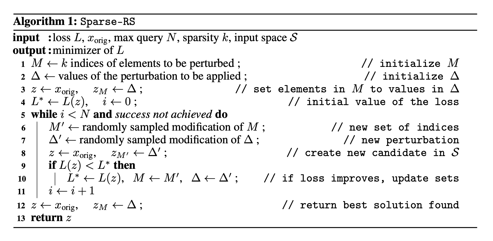
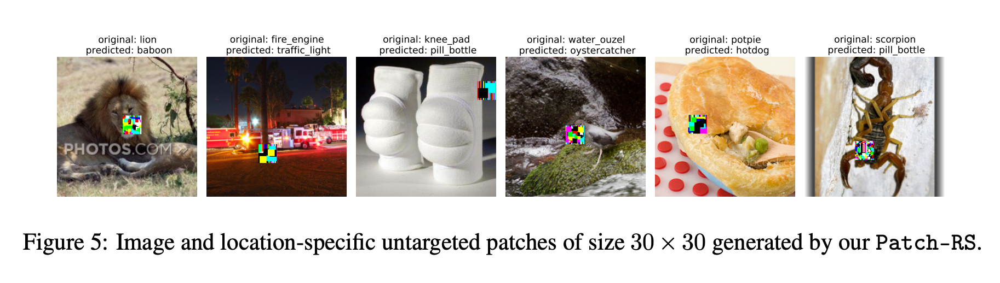
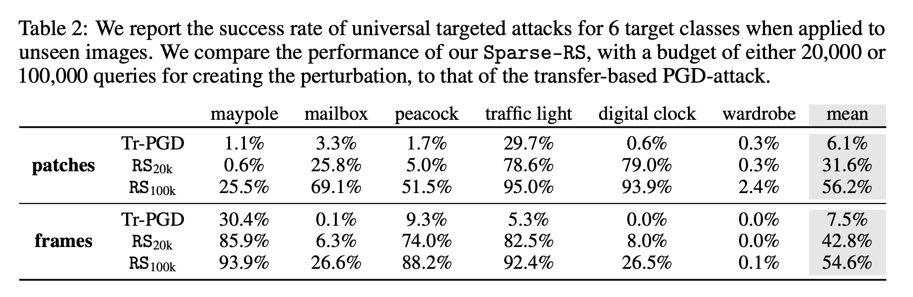
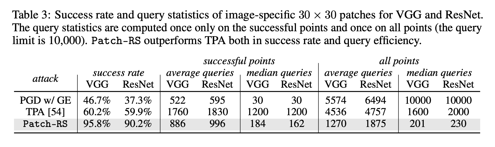
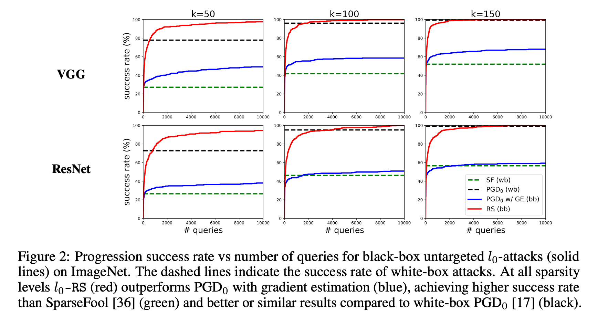

# Sparse-RS: a versatile framework for query-efficient sparse black-box adversarial attacks
**Francesco Croce, Maksym Andriushchenko, Naman D. Singh, Nicolas Flammarion, Matthias Hein**

**University of Tübingen and EPFL**

**Paper:** [https://arxiv.org/abs/2006.12834](https://arxiv.org/abs/2006.12834)

**A short version is accepted to [ECCV'20 Workshop on Adversarial Robustness in the Real World](https://eccv20-adv-workshop.github.io/)**

## Abstract
A large body of research has focused on adversarial attacks which require to modify all input features with small L2- or Linf-norms.
In this paper we instead focus on query-efficient *sparse* attacks in the black-box setting. Our versatile framework, **Sparse-RS**, based on random search
achieves state-of-the-art success rate and query efficiency for different sparse attack models such as L0-bounded perturbations (outperforming established white-box methods), adversarial patches, and adversarial framing. 
We show the effectiveness of **Sparse-RS** on different datasets considering problems from image recognition and malware detection and multiple variations of sparse threat models, including targeted and universal perturbations. 
In particular **Sparse-RS** can be used for realistic attacks such as universal adversarial patch attacks without requiring a substitute model. 


## About the paper
Our proposed **Sparse-RS** framework is based on random search. Its main advantages are its simplicity and its wide applicability 
to multiple threat models:
<p align="center"></p>

We illustrate the versatility of the **Sparse-RS** framework by generating universal targeted patches/frames, and also
image- and location-specific patches:
<p align="center"></p>
<p align="center"></p>

In all these threat models we improve over other approaches:
<p align="center"></p>
<p align="center"></p>

Moreover, for L0-perturbations **Sparse-RS** can even outperform strong white-box baselines such as L0 PGD (see PGD_0 (wb)).
<p align="center"></p>


## Code of Sparse-RS
The code is tested under Python 3.6 and PyTorch 1.4.0. It automatically downloads the pretrained models (either VGG-16-BN or ResNet-50) and requires access to ImageNet validation set.

The following are examples of how to run the attacks in the different threat models.

### L0-bounded
In this case `k` represents the number of pixels to modify. For untargeted attacks
```
CUDA_VISIBLE_DEVICES=0 python eval.py --norm=L0 \
	--model=[pt_vgg | pt_resnet] --n_queries=10000 --alpha_init=0.3 \
	--data_path=/path/to/validation/set --k=150 --n_ex=500
```
and for targeted attacks please use `--targeted --n_queries=100000 --alpha_init=0.1`. The target class is randomly chosen for each point.

As additional options the flag `--constant_schedule` uses a constant schedule for `alpha` instead of the piecewise constant decreasing one, while with `--seed=N` it is possible to set a custom random seed.

### Image-specific patches
For image- and location-specific patches of size 30x30 (with `k=900`)
```
CUDA_VISIBLE_DEVICES=0 python eval.py --norm=patches \
	--model=[pt_vgg | pt_resnet] --n_queries=10000 --alpha_init=0.3 \
	--data_path=/path/to/validation/set --k=900 --n_ex=100
```

### Universal patches and frames
For universal untargeted patches of size 50x50 (with `k=2500`)
```
CUDA_VISIBLE_DEVICES=0 python eval.py \
	--norm=patches_universal --model=[pt_vgg | pt_resnet] \
	--n_queries=100000 --alpha_init=0.3 \
	--data_path=/path/to/validation/set --k=2500 --n_ex=100
```
while for universal untargeted frames of width 4 (with `k=4`)
```
CUDA_VISIBLE_DEVICES=0 python eval.py \
	--norm=frames_universal --model=[pt_vgg | pt_resnet] \
	--n_queries=100000 --alpha_init=0.005 \
	--data_path=/path/to/validation/set --k=4 --n_ex=100
```
For **universal targeted** attacks add at the previous commands `--targeted --target_class=920` with the number corresponding to the target label.

## Visualizing resulting images
We provide a script `vis_images.py` to visualize the images produced by the attacks. To use it please run

```python vis_images --path_data=/path/to/saved/results```
